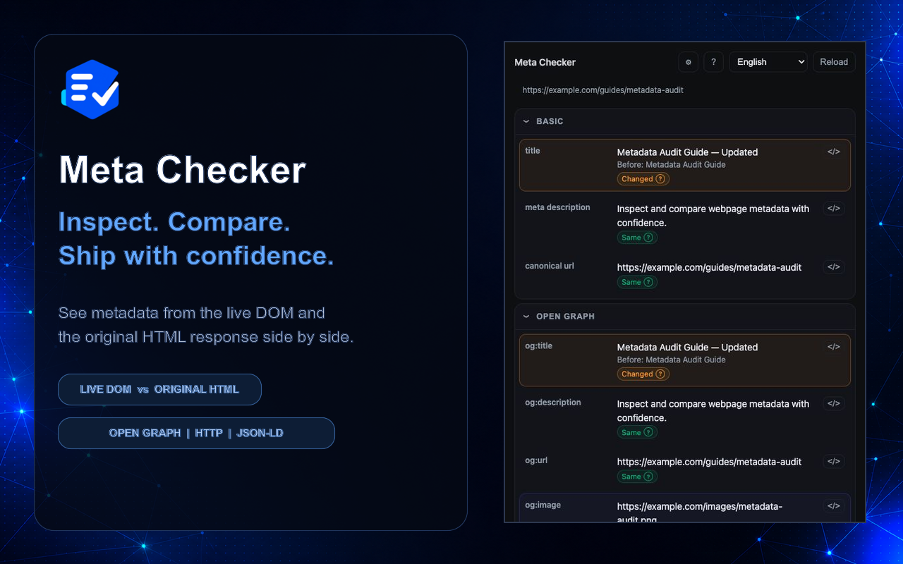
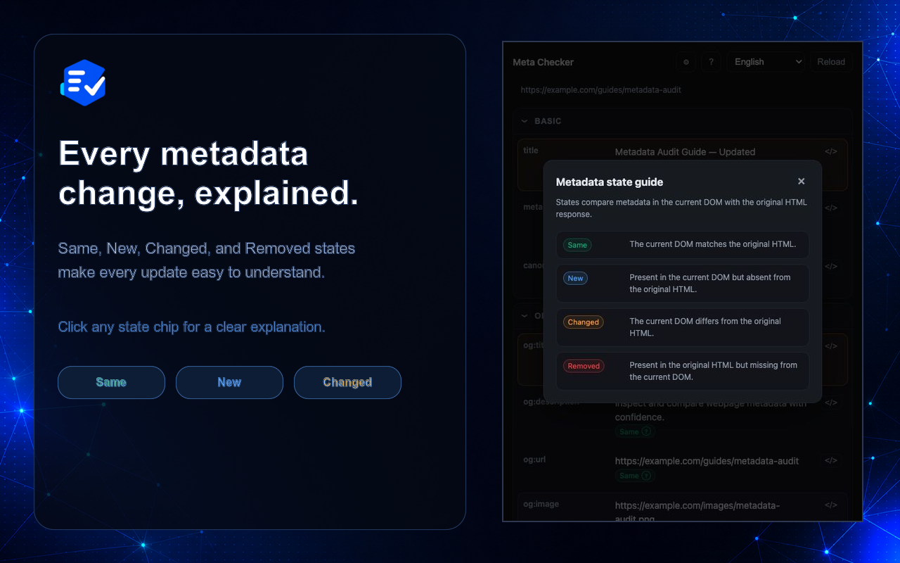

# Meta Checker

[English](README.md) | [한국어](README.ko.md) | [日本語](README.ja.md) | [Español](README.es.md) | [Português (Brasil)](README.pt-BR.md)

**Your metadata mate for GEO & SEO.**

Meta Checker is a Chrome extension that compares metadata in the live DOM with
the original HTML response. It helps you understand what search engines and AI
crawlers may see and quickly spot values that were added, changed, or removed
after the page loaded.

[Install from the Chrome Web Store](https://chromewebstore.google.com/detail/metadata-extractor/pdikiboojnhoacoknfdpndeddocnbmop)

## What you can inspect

- Page title, meta title, meta description, and canonical URL
- Open Graph title, description, type, site name, URL, and image
- Robots directives, document language, and alternate-language links
- HTTP status, final URL, redirects, content type, and `X-Robots-Tag`
- JSON-LD block count, validation errors, and detected `@type` values
- Original tag source through the code button

You can collapse sections and use Display settings to choose entire sections or
individual fields. The popup interface supports English, Korean, Japanese,
Spanish, and Brazilian Portuguese.

## Metadata states

| State | Meaning |
| --- | --- |
| `Same` | The live DOM matches the original HTML response. |
| `New` | The value exists in the live DOM but not in the original response. |
| `Changed` | The live DOM value differs from the original response. |
| `Removed` | The value exists in the original response but not in the live DOM. |

Click any state chip, or the `?` button in the upper-right corner, to open the
state guide.

## How to use

1. Open a regular webpage that you want to inspect.
2. Click Meta Checker in the Chrome toolbar.
3. Review the metadata values and their state chips.
4. Use the code button to view the complete source tag for a value.
5. Use Display settings to select the sections and fields you want to see.
6. Choose an interface language from the language menu.

After installing or reloading the unpacked extension, refresh any webpage that
was already open before launching Meta Checker. Chrome does not inject the new
content script into tabs that were open before the extension was loaded.

## Install locally

1. Download or clone this repository.
2. Open `chrome://extensions` in Chrome.
3. Enable **Developer mode**.
4. Select **Load unpacked**.
5. Choose the repository root containing `manifest.json`.
6. Pin Meta Checker from the extensions menu in the Chrome toolbar.

## Version

Current release: `1.1.0`
